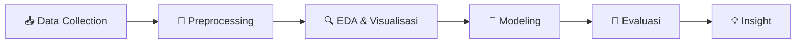

<div align="center">

# ⛏️✨ Data Mining Practice ✨⛏️

### 📚 Kumpulan Kebutuhan Praktikum Penambangan Data 📚

*Dataset • Modul • Eksperimen • Tugas Praktikum*

[](https://github.com/matthewpriantara/Data_Mining_Practice)
[](https://github.com/matthewpriantara/Data_Mining_Practice)
[](https://www.python.org/)
[](https://pandas.pydata.org/)
[](https://jupyter.org/)

---

> 🌸 *"Dari data mentah menjadi wawasan bermakna"* 🌸

</div>

## 🌷 Halo, Selamat Datang! 🌷

Halo semuanya! 👋 Repository ini adalah **arsip pusat** untuk semua hal yang diperlukan selama **Praktikum Penambangan Data (Data Mining)**.

Mulai dari 📦 **dataset**, 📓 **notebook eksperimen**, 🧪 **tugas tiap pertemuan**, sampai 🛠️ **script preprocessing & modeling** — semuanya dikumpulkan rapi di satu tempat biar gampang diakses, dipelajari ulang, dan dikembangkan lagi! 💖

---

## 🎯 Tujuan Repository

| ✨ Poin | 📝 Penjelasan |
| :--- | :--- |
| 📦 **Sentralisasi Dataset** | Menyimpan semua dataset praktikum agar mudah diunduh & digunakan ulang |
| 🧪 **Dokumentasi Praktikum** | Mencatat setiap eksperimen & analisis tiap pertemuan |
| 🔄 **Reproducibility** | Memastikan setiap analisis bisa dijalankan ulang oleh siapa pun |
| 🌱 **Media Belajar** | Tempat belajar preprocessing, klasifikasi, clustering, & evaluasi model |

---

## 🗂️ Struktur Repository

```bash
📁 Data_Mining_Practice/
│
├── 📁 pert_2/                  # 💳 Pertemuan 2 — Analisis Churn Nasabah Bank
│   ├── 📊 BankChurners.csv     #    Dataset utama (±10.127 baris)
│   └── 🗜️ BankChurners.csv.zip #    Versi terkompresi
│
├── 📁 pert_3/                  # 🏦 Pertemuan 3 — Prediksi Persetujuan Pinjaman
│   ├── 📊 loan_data.csv        #    Dataset utama (381 baris)
│   └── 🗜️ archive.zip          #    Arsip pendukung
│
└── 📄 README.md                # 💖 Kamu sedang membacanya!
```

> 📌 *Struktur akan terus bertambah seiring berjalannya praktikum! Stay tuned~* ✨

---

## 📊 Katalog Dataset

### 💳 Pertemuan 2 — `BankChurners.csv`

> Analisis perilaku & churn nasabah kartu kredit bank 🏧

| 🏷️ Info | 📋 Detail |
| :--- | :--- |
| 📁 Lokasi | `pert_2/BankChurners.csv` |
| 📏 Ukuran | ~1.4 MB • 10.127 baris × 23 kolom |
| 🎯 Target | `Attrition_Flag` (Existing Customer / Attrited Customer) |
| ✨ Fitur Menarik | `Customer_Age`, `Gender`, `Credit_Limit`, `Total_Trans_Amt`, `Total_Trans_Ct`, `Avg_Utilization_Ratio`, `Card_Category` |
| 🧪 Cocok Untuk | Klasifikasi Churn, EDA, Feature Engineering, Naive Bayes |

### 🏦 Pertemuan 3 — `loan_data.csv`

> Prediksi status persetujuan pinjaman 💰

| 🏷️ Info | 📋 Detail |
| :--- | :--- |
| 📁 Lokasi | `pert_3/loan_data.csv` |
| 📏 Ukuran | ~26 KB • 381 baris × 13 kolom |
| 🎯 Target | `Loan_Status` (Y / N) |
| ✨ Fitur Menarik | `Gender`, `Married`, `Education`, `ApplicantIncome`, `LoanAmount`, `Credit_History`, `Property_Area` |
| 🧪 Cocok Untuk | Data Cleaning (missing value!), Klasifikasi Biner, Logistic Regression, Decision Tree |

---

## 🧭 Roadmap Praktikum



- [x] ✅ **Pert 2** — Eksplorasi dataset BankChurners
- [x] ✅ **Pert 3** — Preprocessing & klasifikasi data pinjaman
- [ ] 🔜 **Pert 4+** — Clustering, Association Rule, & Model Tuning
- [ ] 🌟 **Final** — Mini Project Data Mining

---

## 🚀 Cara Penggunaan

### 1️⃣ Clone repository ini 💻

```bash
git clone https://github.com/matthewpriantara/Data_Mining_Practice.git
cd Data_Mining_Practice
```

### 2️⃣ Siapkan environment Python 🐍

```bash
pip install pandas numpy matplotlib seaborn scikit-learn jupyter
```

### 3️⃣ Load dataset di notebook 📓

```python
import pandas as pd

# 💳 Dataset Pertemuan 2
df_churn = pd.read_csv("pert_2/BankChurners.csv")
print(df_churn.shape)
print(df_churn.head())

# 🏦 Dataset Pertemuan 3
df_loan = pd.read_csv("pert_3/loan_data.csv")
print(df_loan.shape)
print(df_loan.head())
```

### 4️⃣ Mulai eksplorasi! 🔍✨

```python
# Cek missing value 👀
df_loan.isnull().sum()

# Statistik deskriptif 📊
df_churn.describe(include="all")
```

---

## 🛠️ Tech Stack

<div align="center">


</div>

---

## 🤝 Kontribusi

Kontribusi selalu terbuka lebar! 🌈

1. 🍴 Fork repo ini
2. 🌱 Buat branch baru (`git checkout -b pert-4-clustering`)
3. 💾 Commit perubahanmu (`git commit -m "add: eksperimen clustering pert 4"`)
4. 🚀 Push & buat Pull Request

---

## 👨‍💻 Author

<div align="center">

**Made with 💖 by [matthewpriantara](https://github.com/matthewpriantara)**

*TRPL • Semester 5 • Praktikum Penambangan Data*

⭐ Jangan lupa kasih **star** kalau repo ini membantu kamu! ⭐

---

🌸 *Happy Mining! Semoga datanya bersih & akurasinya tinggi!* 📈✨

</div>
